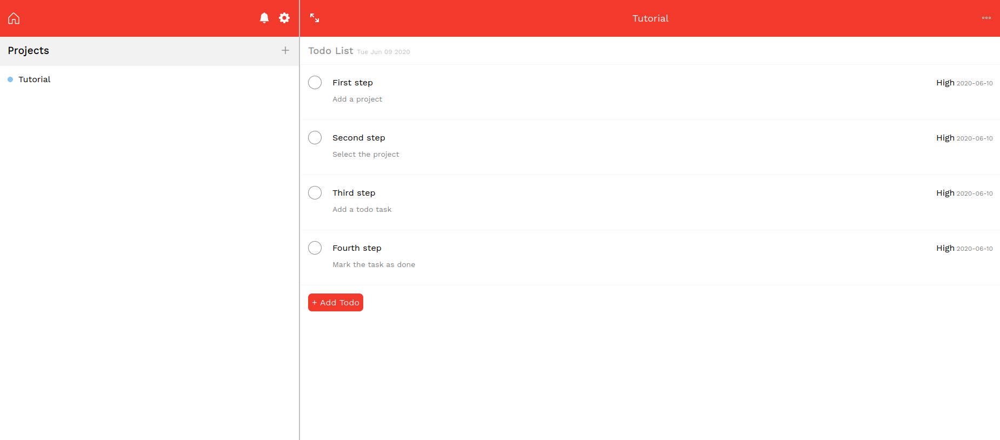

# To Do List - JS App

> We developed a Todo list application in which we had the chance to consolidate our knowledge about OOP principles, organizing JS code using object factories and classes along with ES6 modules, and using Webpack as a module manager. You can create as many projects as you want and also add unlimited 
todo tasks to them.

## Built With

- JS
- HTML
- SASS

## Tools

- Webpack
- npm

## NPM available scripts
Use "npm run-script " followed by any of the following commands : 

- "build": "webpack --mode production"
- "watch": "webpack --mode development --watch"

## Live Demo

[Live Demo Version](https://rawcdn.githack.com/bren2102/To-do-list/69460417a10f8b8390b213942a8b74115993204d/dist/index.html)

## Preview

## Authors

👤 **Diego Antonio Reyes Coronado**

- Github: [@xtrmdarc](https://github.com/xtrmdarc)
- Twitter: [@diegoreyesco](https://twitter.com/DiegoAn91629127)
- Linkedin: [diegoreyesco](https://www.linkedin.com/in/diego-reyes-coronado)

👤 **Brenda Yucra**

- Github: [@bren2102](https://github.com/bren2102) 
- Twitter: [@BrendaYucra2](https://twitter.com/BrendaYucra)
- Linkedin: [Brenda Yucra](https://www.linkedin.com/in/brenda-yucra-51980681/)

## 🤝 Contributing

Contributions, issues and feature requests are welcome!

Feel free to check the [issues page](https://github.com/bren2102/To-do-list/issues).

## Show your support

Give a ⭐️ if you like this project!
